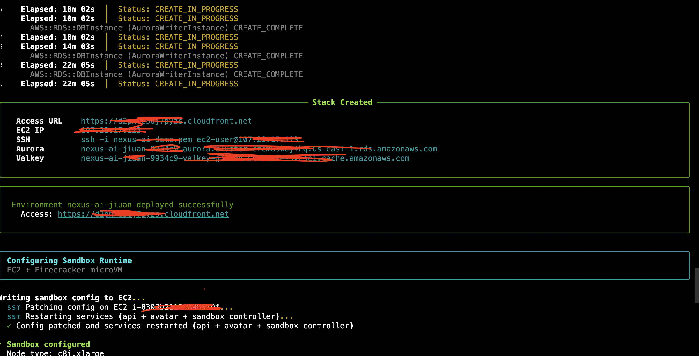
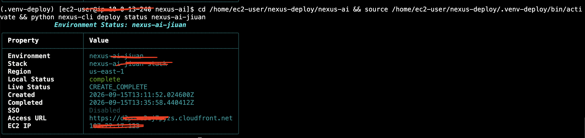

# Nexus AI 部署指南

本文档分为两部分：**维护者发布流程**（生成一键部署链接）和**客户部署流程**（在目标账户中完成部署）。

---

## A. 维护者发布（生成一键部署链接）

> 在 Nexus AI 源码仓库本地执行，生成带签名的一键部署链接供客户使用。

```bash
cd <Nexus AI Dir>
source .venv/bin/activate

./nexus-cli deploy release v0.3.12 \
    --bucket nexus-ai-releases --region us-east-1 \
    --env-prefix nexus-ai-basic --deploy-region us-east-1 \
    --instance-type c8i.2xlarge --volume-size 150 \
    --key-name nexus-ai-demo --db-password '<YourSecurePassword>' \
    --enable-sandbox --sandbox-default-runtime ec2 \
    --sandbox-instance-type c8i.xlarge --sandbox-pool-size 1 --sandbox-max-nodes 5 \
    --enable-avatar \
    --expires-hours 24 \
    --edition basic    # 或 enterprise
```

**输出结果**：打印一行客户命令 `curl -fsSL "<go.sh URL>" | bash`，复制备用。

### 示例（Enterprise 版本）

```bash
./nexus-cli deploy release v0.3.23 \
    --bucket nexus-ai-releases-demo-1 --region us-east-1 \
    --env-prefix nexus-ai-basic --deploy-region us-east-1 \
    --instance-type c8i.2xlarge --volume-size 150 \
    --key-name nexus-ai-demo --db-password '<YourSecurePassword>' \
    --enable-sandbox --sandbox-default-runtime ec2 \
    --sandbox-instance-type c8i.xlarge --sandbox-pool-size 1 --sandbox-max-nodes 5 \
    --enable-avatar \
    --expires-hours 24 \
    --edition enterprise
```

---

## B. 客户部署

> 在客户 AWS 账户的部署机（Amazon Linux 2023）上执行。

### B.1 创建 EC2 Key Pair

在目标 Region 的 EC2 控制台创建密钥对，用于 Nexus AI 实例的 SSH 访问。

```bash
# 示例：在 us-east-1 创建名为 nexus-ai-deploy 的密钥对
aws ec2 create-key-pair \
    --key-name nexus-ai-deploy \
    --key-type rsa \
    --query 'KeyMaterial' \
    --output text > nexus-ai-deploy.pem

chmod 400 nexus-ai-deploy.pem
```

> **记住密钥对名称**，后续部署时需要设置 `NEXUS_KEY_NAME` 环境变量。

### B.2 创建部署机 EC2

在目标 Region 手动创建一台 EC2 实例作为部署机：

| 配置项 | 推荐值 |
|--------|--------|
| AMI | Amazon Linux 2023 |
| 实例类型 | t3.medium 或以上 |
| 存储 | 20 GB gp3 |
| 安全组 | 允许出站 443（HTTPS） |
| IAM 角色 | 见 B.3 步骤创建的 `nexus-ec2-role` |

### B.3 创建 IAM Role

部署机需要具备 Admin 权限，或者使用本仓库提供的最小权限策略。

**方式一：使用一键部署脚本（推荐）**

```bash
# 克隆本仓库或下载 nexus-ec2-role-policy 目录
cd nexus-ec2-role-policy

# 预览将执行的操作
bash deploy.sh --dry-run

# 执行部署（幂等，可重复执行）
bash deploy.sh
```

脚本会创建：
- IAM Role: `nexus-ec2-role`
- 托管策略: `nexus-ec2-role-runtime`（运行时权限）
- 托管策略: `nexus-ec2-role-deploy`（部署权限）
- 实例配置文件: `nexus-ec2-role`

详细说明见 [nexus-ec2-role-policy/README.md](./nexus-ec2-role-policy/README.md)

**方式二：使用 Admin 权限**

将部署机绑定具有 `AdministratorAccess` 的 IAM Role（仅推荐用于测试环境）。

### B.4 执行部署

登录部署机后执行：

```bash
# 设置环境变量（使用 B.1 步骤创建的密钥对名称）
export NEXUS_KEY_NAME='nexus-ai-deploy'
export NEXUS_DB_PASSWORD='<YourSecurePassword>'

# 执行一键部署（URL 由维护者提供）
curl -fsSL "https://nexus-ai-releases.s3.amazonaws.com/releases/v0.3.12/go.sh?X-Amz-Algorithm=AWS4-HMAC-SHA256&X-Amz-Credential=xxxxxxx...." | bash
```

**预计耗时**：25–35 分钟

#### 部署完成输出

部署成功后，终端会显示 Stack 创建完成的信息，包含访问地址和资源详情：



输出内容包括：
- **Access URL**：CloudFront 访问地址
- **EC2 IP**：主实例公网 IP
- **SSH**：SSH 连接命令
- **Aurora**：数据库集群端点
- **Valkey**：缓存集群端点

#### 查看部署状态

可以使用以下命令查看环境状态：

```bash
cd /home/ec2-user/nexus-deploy/nexus-ai
source /home/ec2-user/nexus-deploy/.venv-deploy/bin/activate
python nexus-cli deploy status <env-prefix>
```



状态信息包括：
- **Environment**：环境名称
- **Stack**：CloudFormation Stack 名称
- **Region**：部署区域
- **Live Status**：`CREATE_COMPLETE` 表示部署成功
- **Access URL**：应用访问地址
- **EC2 IP**：实例 IP 地址

---

## C. 验证

1. **访问应用**：打开终端输出的 CloudFront 地址
2. **登录**：使用默认凭证 `admin/nexus`
3. **修改密码**：点击左下角用户头像，修改默认密码
4. **检查服务状态**：进入运维/服务面板，确认：
   - 默认运行模式为 EC2
   - Sandbox 节点正常运行

---

## D. 清理（回滚/止损）

如需删除部署的资源：

```bash
cd ~/nexus-deploy/nexus-ai
source .venv-deploy/bin/activate 2>/dev/null || source .venv/bin/activate

# <stack-prefix> 替换为部署时使用的 env-prefix 值
python nexus-cli deploy down <stack-prefix> --clean-data -y
```

> **警告**：`--clean-data` 会删除所有数据，请确认后再执行。

---

## 附录：参数说明

| 参数 | 说明 | 示例值 |
|------|------|--------|
| `--bucket` | 存放发布包的 S3 桶 | `nexus-ai-releases` |
| `--region` | S3 桶所在 Region | `us-east-1` |
| `--env-prefix` | 资源命名前缀 | `nexus-ai-basic` |
| `--deploy-region` | 部署目标 Region | `us-east-1` |
| `--instance-type` | 主实例类型 | `c8i.2xlarge` |
| `--volume-size` | EBS 卷大小 (GB) | `150` |
| `--key-name` | EC2 密钥对名称 | `nexus-ai-demo` |
| `--db-password` | 数据库密码 | `NexusVerify2026!` |
| `--enable-sandbox` | 启用沙箱环境 | - |
| `--sandbox-default-runtime` | 沙箱运行时类型 | `ec2` |
| `--sandbox-instance-type` | 沙箱实例类型 | `c8i.xlarge` |
| `--sandbox-pool-size` | 沙箱预热池大小 | `1` |
| `--sandbox-max-nodes` | 沙箱最大节点数 | `5` |
| `--enable-avatar` | 启用头像功能 | - |
| `--expires-hours` | 签名链接有效期 (小时) | `24` |
| `--edition` | 版本类型 | `basic` / `enterprise` |
